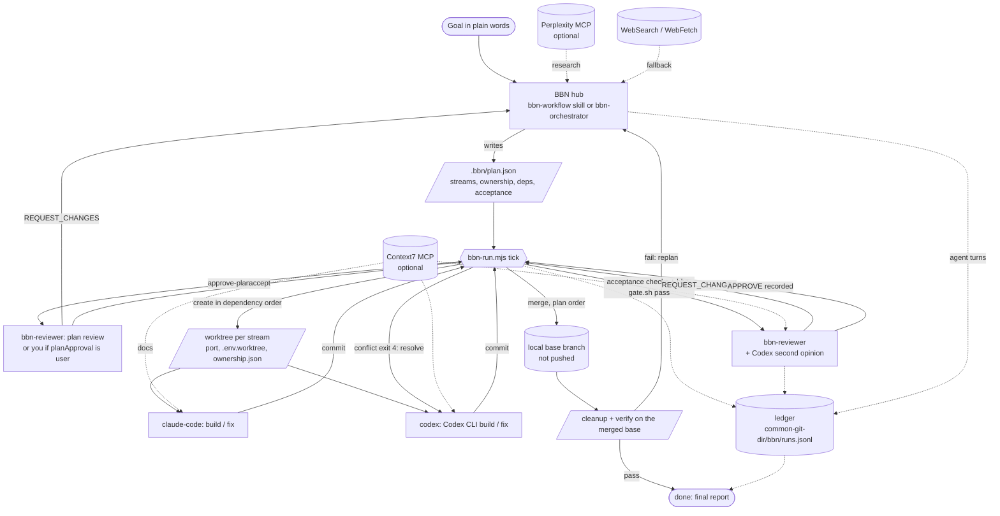

# BBN architecture - Boom Big Nose Workflow (v0.5.0)

BBN coordinates several AI agent roles in one workflow: a hub plans and dispatches, a harness does the mechanical steps and checks, each feature gets its own git worktree, and nothing reaches the base branch without passing a gate and an independent review. It started from the "Getting started with BBN" infographic (multi-agent roles, Perplexity MCP and Context7 MCP), extended with review, merge and isolation rules, and since v0.5 runs on autopilot.

> "Claude Code" and "Codex" here are **roles implemented as Claude Code subagents** in this plugin. Since v0.5 the `codex` role drives the real Codex CLI (`scripts/bbn-codex.sh`) with your own Codex login; nothing else logs in to an external product.

## Flow

## Roles

| Agent | Model | Job | Tools | maxTurns |
|---|---|---|---|---|
| hub: `bbn-workflow` skill (main thread) or `bbn-orchestrator` | Claude Opus 5.5, effort max | requirements, research, plan, harness ticks, dispatch | all | 150 (`bbn-orchestrator`) |
| `bbn-reviewer` | Claude Opus 5.5, effort high | approves or rejects the plan; reviews each branch with the gate results and a Codex second opinion; records the verdict | all except Write/Edit/NotebookEdit | 25 |
| `claude-code` | Claude Sonnet 5.5, effort high | implement, refactor or fix in one worktree, then commit | all | 40 |
| `codex` | Claude Haiku 5.5 driving the Codex CLI (`gpt-6.1-sol`, reasoning `xhigh`) | multi-file integration and conflict resolution; Codex edits the files, the driver checks and commits | all | 40 |

`maxTurns` in each agent's frontmatter is enforced by Claude Code; `bbn.config.json` holds the same numbers and `bbn-config-check.mjs` fails if they drift. The Codex model and effort come from `bbn.config.json` → `codex`, or `BBN_CODEX_MODEL` / `BBN_CODEX_EFFORT`. When the Codex CLI is not installed (`bbn-codex.sh` exit 3), the stream goes to `claude-code`; `/bbn-doctor` warns about it.

## Harness and autopilot (v0.5)

- **Autopilot.** The `bbn-workflow` skill starts on its own when you ask for a coding goal in a git repo that spans several files or parts; no slash command is needed. For a fully automatic session, start Claude Code with `claude --agent boom-big-nose-workflow:bbn-orchestrator`. The hub loops: `node scripts/bbn-run.mjs --apply --json` → dispatch the returned actions (all agent actions of one tick in parallel) → record each agent run in the ledger → tick again, until `done` or `stop`.
- **Harness** `scripts/bbn-run.mjs` reads the plan, the worktrees, the state files in each worktree's `<git-dir>/bbn/` (`accept.json`, `gate.json`, `review.json`) and the ledger. With `--apply` it does every mechanical step itself: create worktrees in dependency order, run each stream's acceptance checks on its HEAD, run the gate (when the project has no lint/typecheck/test it writes `.bbn/gate.sh` from the acceptance commands), merge approved branches into the local base one at a time in plan order, clean up, then `verify`: every acceptance check plus the gate on the merged base. Without `--apply` it only shows the next actions; `bbn-run.mjs verify` checks the base now.
- **Agent actions** it returns: `plan`, `fix-plan`, `approve-plan`, `build`, `fix`, `review`, `resolve`, `ask-merge`, `replan`; plus `wait`, `stop` and `done`.
- **Checkpoints.** By default `bbn-reviewer` approves the hub's plan (`bbn-plan.mjs accept --by reviewer`) and approved branches merge into the local base without asking. In `bbn.config.json` → `automation`, `planApproval: "user"` waits for your OK on the plan and `merge: "ask"` asks before each merge. The harness never pushes; pushing, PRs and deploying stay your call.
- **Stops.** A stream stops after `hardStopOnRepeatedFailures` (3) failed checks or reviews since its last approval, after a BLOCK, or when a step makes no progress. BBN reports the stream and why, and keeps driving the others. `done` means `verify` passed on the merged base.

## Gate and merge

- `bbn-gate.sh`: `BBN_GATE_CMD` or `.bbn/gate.sh` if present (a non-executable one fails the gate), else auto-detect flutter / pnpm / yarn / bun / npm (lint, typecheck, test), cargo, go, pytest. Exit 0 pass, 1 fail, 2 nothing to run. The result is stored for the current commit in the worktree's git dir (`<git-dir>/bbn/gate.json`), never in the work tree.
- `bbn-review-record.sh`: stores the reviewer's verdict with a **patch fingerprint** (`git patch-id --verbatim` of the branch diff, git 2.39+). A clean rebase keeps the fingerprint; new commits, conflict edits and whitespace changes change it, so the approval no longer counts.
- `bbn-merge.sh`: dry-run by default. `--apply`: refuse without APPROVE or with a dirty tree, refuse if the fingerprint changed, rebase on base (conflict, so exit 4 to Codex), re-check the fingerprint, run the gate on the rebased tree, then `merge --no-ff` into the local base in whichever worktree has it checked out (or a temporary one). It never pushes the base branch and never force-pushes. `--apply --pr` pushes the feature branch (no force) and opens a draft PR with `gh`.
- `bbn-status.sh`: every worktree with ahead/behind, dirty, gate/review state (`*` = recorded for an older commit), and files changed on more than one branch, the input for merge order.
- `bbn-plan.mjs`: the plan checkpoint as a file (see "Plan, queue, ledger"); `accept --by user|reviewer`, `apply --only SLUG --base REF`.
- `bbn-run.mjs`: the harness (see "Harness and autopilot").
- `bbn-codex.sh`: runs the Codex CLI in the current worktree. `run "<brief>"` edits files in a `workspace-write` sandbox and the caller commits; `review [--base REF]` is a read-only second opinion that ends with a `VERDICT` line. Exit 3 when the CLI is missing; limit `codex.timeoutSec`.
- `bbn-queue.mjs`: merge order with predicted conflicts (read-only).
- `bbn-cleanup.sh`: dry-run by default; removes clean worktrees of merged branches; `--delete-branches` uses `git branch -d` (merged only); `--include-unmerged` removes clean unmerged worktrees but keeps their branches.

## Plan, queue, ledger (v0.4)

- **Plan** `<main worktree>/.bbn/plan.json` (schema `bbn.plan.schema.json`, git-excluded). `check`: schema, stream count <= `maxParallelWorktrees`, `minAcceptanceChecks`, repo-relative paths, known dependencies without cycles, and file ownership: two streams may own overlapping paths only when one depends on the other (then it is a warning, because they merge in order). `accept` stores `planHash`; `apply --apply` refuses an unaccepted or edited plan (exit 3) and creates worktrees in topological order, writing role, paths, dependencies and acceptance into `.bbn/ownership.json`.
- **Queue** `bbn-queue.mjs` runs `git merge-tree --write-tree` for each branch against the base and for each pair of branches that touch the same files, without touching any checkout. Order: plan dependencies, then ready (gate + review recorded for the current commit), base conflicts, pairwise conflicts, overlaps, diff lines. `bbn-merge.sh --apply` enforces the dependency part (exit 3; `--ignore-order` overrides).
- **Ledger** `<common-git-dir>/bbn/runs.jsonl`: one JSON line per event, shared by all worktrees, never committed. Script events: `worktree.create`, `gate`, `review`, `merge` (`result` = merged / refused / conflict / stale_review / gate_failed / draft_pr), `merge.dryrun`, `plan.accept` (with `by`), `plan.apply`, `cleanup`; since v0.5 also `accept`, `run.merge`, `verify` (harness) and `codex` (`bbn-codex.sh`). The orchestrator adds `agent` events (`role`, `turns`, `status`). `bbn-report.mjs` sums them and flags runs that hit `maxTurns` (`partial`), failed, or exceeded budget; `--strict` exits 1 on any of these.
- **Exit codes** are shared by every script: [exit-codes.md](exit-codes.md).

## Isolation per worktree

`worktree-new.sh` gives each worktree a deterministic dev port (`portBase + cksum(slug) % portRange`), a `.env.worktree` (copied from `.env` when present, plus `BBN_DEV_PORT`/`PORT`), and `.bbn/ownership.json` (paths, DB branch `wt-<slug>`). Both are added to the repo's local `info/exclude`. Rules: one DB branch per worktree (for Supabase, a preview branch), base migrations before feature migrations, never a shared writable DB. The script refuses beyond `maxParallelWorktrees`.

## MCP routing

| Server | Used by | For | Auth | Fallback |
|---|---|---|---|---|
| Perplexity (`api.perplexity.ai/mcp`) | the hub only | research, current facts | sign-in via `/mcp` (OAuth) | WebSearch + WebFetch |
| Context7 (`mcp.context7.com/mcp`) | claude-code, codex, reviewer | library/API docs | none (optional key) | WebFetch official docs |

## Weakness -> fix

| Weakness (v0.1) | Fix | Since |
|---|---|---|
| No review/test gate before merge | `bbn-reviewer`, `bbn-gate.sh`, `/bbn-review`; merge requires a recorded APPROVE | 0.2.0, enforced in 0.3.0 |
| No conflict process | ownership maps, `/bbn-status` overlap report, rebase-before-merge, Codex owns conflicts, patch fingerprint forces re-review | 0.2.0 / 0.3.0 |
| BBN single point of failure | plan checkpoint + re-plan, independent reviewer, decision log | 0.2.0 |
| No budgets | `bbn.config.json` + enforced `maxTurns`; worktree cap in `worktree-new.sh` | 0.2.0 / 0.3.0 |
| Shared DB/ports/env | per-worktree port, `.env.worktree`, DB branch rule, migration order | 0.2.0 |
| MCP use undefined | routing table; agents can now actually reach MCP (denylist, not allowlist); fallbacks; doctor fix hints | 0.2.0 / 0.3.0 / 0.4.0 |
| Plan checkpoint only in the prompt | `.bbn/plan.json` + `bbn-plan.mjs` (accept hash, apply refuses changed plans) | 0.4.0 |
| Merge order a judgement call; conflicts found at rebase | `/bbn-queue` with `git merge-tree` prediction; merge refuses unmerged plan dependencies | 0.4.0 |
| Budgets enforced but invisible | run ledger + `/bbn-report` (turns vs `maxTurns`) | 0.4.0 |
| A hung gate step could block forever | per-step timeout `stepTimeoutSec` | 0.4.0 |
| Every step waited for a slash command | `bbn-workflow` skill on autopilot + `bbn-run.mjs` harness; human checkpoints opt-in via `automation` | 0.5.0 |
| Builders checked their own work | harness runs the acceptance checks and gate on the exact commit; reviewer gets a Codex second opinion | 0.5.0 |
| Retries could loop forever | stop after `hardStopOnRepeatedFailures` failed checks or reviews, or a step with no progress | 0.5.0 |

## Changes in v0.3.0

- **Perplexity 401 fixed**: the empty `Bearer ${PERPLEXITY_API_KEY}` header (key not set) caused 401 and blocked OAuth. The plugin now uses sign-in; API key is an opt-in route (README). See ADR-0002.
- **Agents could not use MCP**: `tools:` allowlists hid MCP tools; switched to `disallowedTools`. `color: magenta` (invalid) -> `purple`. `maxTurns` added.
- **Merge rewritten**: v0.2 ran the gate before rebasing and tried to `checkout` the base inside the feature worktree (fails when base is checked out elsewhere). Now: rebase, then gate, then fingerprint check, then merge in the base worktree.
- **New**: `/bbn-doctor`, `/bbn-status`, `/bbn-cleanup`, `bbn-review-record.sh`, draft-PR path, GitHub Actions template, JSON schema + validator, bash test suite, CHANGELOG.

## Changes in v0.4.0

- **Plan checkpoint enforced** by `/bbn-plan` (ADR-0003).
- **Merge queue** with predicted conflicts, and ordered merges.
- **Ledger + report** of turns per agent vs budget.
- **Hardening**: gate step timeout, shared exit codes, `GIT_TERMINAL_PROMPT=0`, shellcheck-clean scripts, doctor fix hints and 401 guard, feature branches created without upstream tracking (cleanup could not delete them).
- **Tests**: `tests/smoke.sh` end-to-end dry run in a temp repo, plus unit tests for every new script.

## Changes in v0.5.0

- **Removed (breaking)**: the `grok-build` agent. The hub (the `bbn-workflow` skill, or `bbn-orchestrator` as the main agent) plans and researches itself; Perplexity is routed to the hub only.
- **Autopilot**: the `bbn-workflow` skill starts on its own for a multi-part coding goal in a git repo and runs the whole loop with no slash commands. The `/bbn-*` commands stay as manual controls.
- **Harness** `bbn-run.mjs`: worktrees, acceptance checks, gate, local merges in plan order, cleanup and a final `verify` of the merged base; it stops a stream instead of looping and never pushes.
- **Real Codex CLI** through `bbn-codex.sh` (`run` to edit, `review` for a second opinion); the `codex` role drives it, `claude-code` takes over when it is missing.
- **Model tiers**: hub and reviewer on Claude Opus 5.5 (effort max / high), `claude-code` on Claude Sonnet 5.5, `codex` on Claude Haiku 5.5 driving `gpt-6.1-sol` at `xhigh`.
- **Checkpoints**: the reviewer approves the plan and approved branches merge into the local base by default; `automation.planApproval: "user"` and `automation.merge: "ask"` bring the human checkpoints back.

## Decision log

`docs/decisions/` holds this plugin's ADRs (0001 review gate, 0002 Perplexity sign-in, 0003 plan file + ledger + merge queue) and `ADR-TEMPLATE.md` for projects that use BBN.
